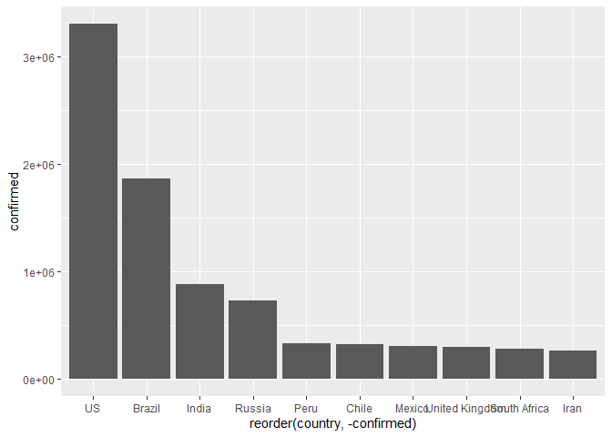

HelloWorld
================
JunPark
7/13/2020

# Hello World\!

This is my first step into R & R studio.

## Markdown

Interestingly, we can use R with Markdown page. If you’re not familiar
with Markdown format, you can find more information for Markdown at
[here](https://github.com/adam-p/markdown-here/wiki/Markdown-Cheatsheet).

## How to write code?

The simple way to write code in Markdown format is using **\`** symbols.

By using three of **\`** symbols with {r} mark, you can simply add R
code into Markdown page, or you also able to insert the code preset by
clicking the insert button on top of RStudio IDE.

## Using Data

``` r
data(mtcars)
```

We can simply use the pre-loaded dataset for the test.

## Let’s get a data from the URL\!

``` r
COVID_REALTIME_DATA <- read.csv(url("https://raw.githubusercontent.com/Nitro1231/COVID-19-Actions/master/LastUpdated/Reorganized/combined.csv"))
```

You can simply use read.csv(url“URL OF CSV”) to download and read CSV
data from the published online sources. The files that just load from
the URL is a COVID-19 dataset that provided by
[JHU](https://github.com/CSSEGISandData/COVID-19). You also can find a
reorganized dataset from my
[repository](https://github.com/Nitro1231/COVID-19-Actions).

## Display Top 10

``` r
require("ggplot2")
```

    ## Loading required package: ggplot2

``` r
COVID_REALTIME_DATA <- read.csv(url("https://raw.githubusercontent.com/Nitro1231/COVID-19-Actions/master/LastUpdated/Reorganized/combined.csv"))

tData <- COVID_REALTIME_DATA[order(COVID_REALTIME_DATA$confirmed, decreasing = TRUE),][1:10,]
table = data.frame(country = tData$Country.Region, confirmed = tData$confirmed)
ggplot(data=table, aes(x=reorder(country, -confirmed), y=confirmed)) + geom_bar(stat = "identity")
```

<!-- -->

You can select a column by using **$** mark right next to the dataframe
object. To change the order or select a certain range of data, you can
use **\[ \]** to set range of column or call other functions. To draw
this graph, I used a library called “ggplot2.”
